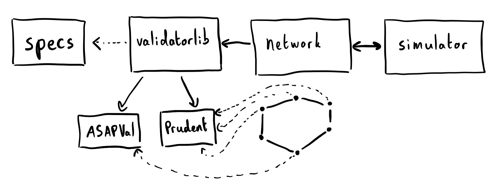

An agent-based model of [Ethereum's Proof-of-Stake consensus layer](https://github.com/ethereum/eth2.0-specs).

## Beacon Runner in practice

Notebooks using the current `beaconrunner` library.

### 05. [Altair incentives](notebooks/altair_incentives.html) + [source](notebooks/altair_incentives.ipynb)

Altair is a planned upgrade to the PoS consensus layer. We check that Altair incentives provide the expected rewards per validator by simulating the protocol for a few epochs.

## Early notebooks

The beacon runner was built iteratively over several notebooks. Early notebooks use early iterations of the Beacon Runner codebase and will not function with the current code contained in this package. These early notebooks however provide background to PoS Ethereum concepts and to the general approach of our simulations. The code necessary to run them is provided in the source links.

### 01. [Beacon Runner: A BeaconState cadCAD wrap](notebooks/beaconrunner/br.html) + [source](notebooks/beaconrunner)

This notebook introduces basic Ethereum PoS concepts and provides a "centralised client" implementation. We introduce the main duties of validators in PoS: producing blocks and attesting. In this implementation, the centralised client is the only one adding blocks to the beacon chain and attesting, thus it also has perfect view of the chain. This allows us to focus on the interplay between state (the state of the beacon chain) and policies (the duties performed by the centralised client).

### 02. [Beacon Runner 2049: Liveness and inactivity leak](notebooks/beaconrunner2049/br2049.html) + [source](notebooks/beaconrunner2049)

The centralised client of the previous notebook was the only agent producing blocks and attestations. In this notebook, we introduce validators distributed over a peer-to-peer network, who exchange the blocks and attestations they produce. We assume the network is split in half, such that neither half is able to finalise the state of the beacon chain, focusing on the cryptoeconomic mechanism that allows finalisation to resume. Our implementation is still somewhat centralised, in the sense that all validators in the same half of the network have the same view of the chain (albeit a different view from the other half's).

### 03. [Beacon Runner 2050: An agent-based model of PoS Ethereum](notebooks/beaconrunner2050/br2050.html) + [source](notebooks/beaconrunner2050)

We fully decentralise the model of the previous notebook by allowing each validator to have its own view of the chain. Additionally, we provide an interface to model the behaviour of validators, using a simple API. In this notebook, we implement honest validation and observe the progress of the chain.

### 04. [Beacon Runner: Thunderdome](notebooks/thunderdome/thunderdome.html) + [source](notebooks/thunderdome)

We show that honest, protocol-following agents sometimes perform worse than agents who behave more prudently. This is the case when latency is bad enough that agents hedge their bets before taking action. Agents are modelled with the beacon runner validator API and simulated.

## Starting up

You can simply run the following commands in a terminal.

```shell
git clone https://github.com/ethereum/beaconrunner.git
cd beaconrunner

###
# Optional: use a virtual environment
# Python 3.8 is required
python3.8 -m venv venv

# Unix
source venv/bin/activate

# Windows
.\venv\Scripts\activate
###

pip install -r requirements.txt
```

Once you enter the shell, you can type in

```shell
jupyter lab
```

## General architecture



The architecture is layered to make it simpler to extend individual layers. The tl;dr is that `validatorlib` is an "intelligent" wrap of the `specs`, `network` instantiates validators from `validatorlib` to place them on its network and the `simulator` helps move the simulation along, by specifying simulation transitions.

### [`specs`](beaconrunner/specs.py)

We take the [eth2.0 specs](https://github.com/ethereum/eth2.0-specs) as our ground truth. We can export the specs to a python file using custom presets and configuration (mostly turning down the size of some of the data structures).

#### Specs modifications

Although our principle is to take the code as is and only "wrap" it around in an execution environment, we have brought the following changes in `specs.py`:

- Turn off crypto operations for performance improvement:
    - Set `bls.bls_active = False`
    - Turn off `is_valid_indexed_attestation` everywhere
    - Turn off `is_valid_merkle_branch` in `process_deposit`

- Modify `on_block` to use store:
    - Add `state: BeaconState = None` to the arguments.
    - Add the following code block in the body:
        ```python
        # Check the block is valid and compute the post-state
        if state is None:
            state = state_transition(pre_state, signed_block, True)
        else:
            process_block(state, signed_block.message)
        ```
        in place of
        ```python
        # Check the block is valid and compute the post-state
        state = state_transition(pre_state, signed_block, True)
        ```

### Validator interface [`validatorlib`](beaconrunner/validatorlib.py)

The specs obtained are mostly responsible for three tasks:

1. Defining the state transition (`beacon-chain.md`). This is where rewards and penalties are applied and where blocks are processed to apply the state transition.
2. Defining the honest validator behaviour (`validator.md`). In particular, this holds useful functions such as `get_committee_assignment`, which we can use in our interface to feed data to the validator.
3. Defining the fork choice rule (`fork-choice.md`). Validators have knowledge of existing blocks and attestations, some of which are already included in the beacon chain, some of which only broadcasted on the p2p network. Based on this knowledge, validators decide which is the correct head of the chain. We use the `Store` object defined in the `fork-choice.md` file to hold this knowledge.

In the `beaconrunner` library, the [`validatorlib.py`](beaconrunner/validatorlib.py) file is the interface between our validator behaviours (held in [`beaconrunner/validators`](beaconrunner/validators)) and the environment.

All validators inherit from `BRValidator`, defined in [`validatorlib.py`](beaconrunner/validatorlib.py). This class has a `store` attribute, from which validators obtain the current head of the beacon chain, as well as a `data` attribute, which we use to store current validation information, such as their assignment to committees.

The main role of this class is to provide up-to-date data to validator. For instance, in `update_data`, the validator reacts to a new event:

- Either a new block or a new attestation was received
- Or a new slot is reached

In both cases, this warrants an update of the validator's data. When a new block is received, either that block builds on the current head, or it is a fork of the existing chain. In the latter case, this sometimes means that the validator assignment to committees has changed. We check whether these conditions are satisfied in `update_data` and call for a refresh of the `get_committee_assignment`.

`BRValidator` also logs the history of play of validators, so that validators can refer back to it when performing their duties ("have I already attested in this slot? history says yes...")

We also define `honest_attest` and `honest_propose`, which can be used by validators to build their behaviours (see [Thunderdome](https://ethereum.github.com/ethereum/beaconrunner/notebooks/thunderdome/thunderdome.html) for an example of how they are used).

### Validator behaviours [`beaconrunner/validators`](beaconrunner/validators)

Validator behaviours (e.g., [ASAPValidator](beaconrunner/validators/ASAPValidator.py)) follow a simple API.

- `def <duty>(self, known_items)`

By calling `self.data`, a validator has access to its "environment knowledge": did they perform the duty already? how far into the slot are they? which is the current epoch? are they supposed to perform the duty?

We follow the principle that a validator should not introspect anything else than this `data` attribute, in particular, not its `store`. Whenever a validator needs access to additional info, a "translation" should be made in `BRValidator` to have this info accessible in `self.data` (for instance, we don't want validator behaviours to call `get_committee_assignment`, they should be able to access up-to-date info in their `data` attribute instead). This makes for a cleaner separation as well as better performance, as we can cache results of expensive operations.

`known_items` is fed from the `network`, these are the blocks and attestations on the p2p network that the validator knows about. It is used in `honest_propose` for instance, where a validator takes latest attestations and packages them in a block.

### [`network`](beaconrunner/network.py)

The network object is populated with subclasses of `BRValidator` which define the behaviour of various types of validators (`ASAP` and `Prudent` behaviours are given in the current library). The network is responsible for propagating data over a simulated p2p network.

Whenever a validator produces an item (a block, an attestation), it is sent on the network and disseminated over time to the other validators.

### [`simulator`](beaconrunner/simulator.py)

This class is responsible for implementing the simulation proper. It defines the steps in the `simulate` method:

1. `tick`: move the environment "clock" by one step. We can the frequency is a parameter, with higher frequency => smaller time steps => more simulation steps.
2. `attest_policy`: responsible for "pinging" the validators for their attestations.
3. `update_attestations`: send the obtained attestations over the network.
4. `propose_policy`: responsible for "pinging" the validators for their block.
5. `update_blocks`: send the obtained blocks over the network.

Most of the time, validators do not have anything to attest or propose, so the simulation proceeds.

## Docs

Some documentation is available [here](https://ethereum.github.io/beaconrunner/docs/build/html/).
